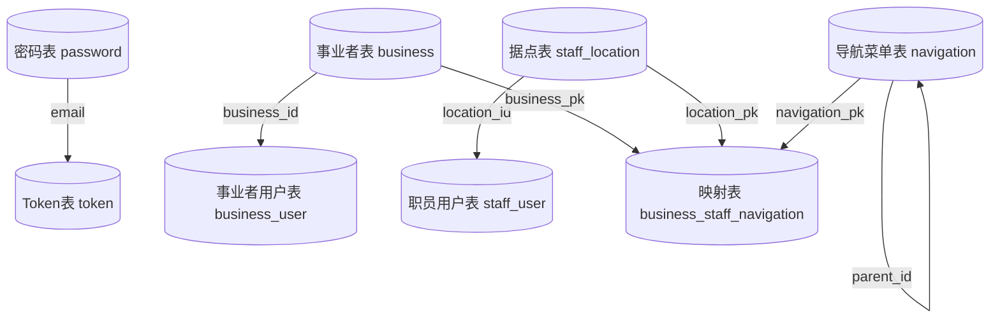

# 密码表

```sql
CREATE TABLE public."password" (
pk int4 DEFAULT nextval('passwords_pk_seq'::regclass) NOT NULL, -- 主键
email varchar(255) NOT NULL, -- 邮箱，作为登录账号
"password" varchar(255) NOT NULL, -- 加密后的密码
is_locked bool DEFAULT false NULL, -- 是否被锁定
login_status varchar(20) DEFAULT 'OFFLINE'::character varying NULL, -- 登录状态: OFFLINE/ONLINE
retry_count int4 DEFAULT 0 NULL, -- 密码重试次数
created_at timestamp DEFAULT CURRENT_TIMESTAMP NOT NULL, -- 创建时间
updated_at timestamp DEFAULT CURRENT_TIMESTAMP NOT NULL, -- 更新时间
CONSTRAINT passwords_email_key UNIQUE (email),
CONSTRAINT passwords_pkey PRIMARY KEY (pk)
);
CREATE INDEX idx_passwords_email ON public.password USING btree (email);
COMMENT ON TABLE public."password" IS '密码表';

-- Column comments

COMMENT ON COLUMN public."password".pk IS '主键';
COMMENT ON COLUMN public."password".email IS '邮箱，作为登录账号';
COMMENT ON COLUMN public."password"."password" IS '加密后的密码';
COMMENT ON COLUMN public."password".is_locked IS '是否被锁定';
COMMENT ON COLUMN public."password".login_status IS '登录状态: OFFLINE/ONLINE';
COMMENT ON COLUMN public."password".retry_count IS '密码重试次数';
COMMENT ON COLUMN public."password".created_at IS '创建时间';
COMMENT ON COLUMN public."password".updated_at IS '更新时间';
```

---
# Token表
```sql
CREATE TABLE public."token" (
	pk bigserial NOT NULL, -- 主键ID，自增序列（使用手动创建的tokens_pk_seq序列）
	email varchar(255) NOT NULL, -- 用户邮箱地址，关联用户唯一标识，用于匹配令牌所属用户
	refresh_token varchar(255) NOT NULL, -- 刷新令牌字符串，用于获取新的访问令牌（access_token）
	expires_at timestamp NOT NULL, -- 令牌过期时间戳，精确到秒，过期后令牌失效
	created_at timestamp DEFAULT CURRENT_TIMESTAMP NOT NULL, -- 令牌记录创建时间，默认当前时间，不可为空
	updated_at timestamp DEFAULT CURRENT_TIMESTAMP NOT NULL, -- 令牌记录更新时间，默认当前时间，不可为空
	CONSTRAINT tokens_pkey PRIMARY KEY (pk)
);
COMMENT ON TABLE public."token" IS '令牌存储表：存储用户刷新令牌（refresh_token）信息，用于身份认证会话续期，关联用户邮箱唯一标识';

-- Column comments

COMMENT ON COLUMN public."token".pk IS '主键ID，自增序列（使用手动创建的tokens_pk_seq序列）';
COMMENT ON COLUMN public."token".email IS '用户邮箱地址，关联用户唯一标识，用于匹配令牌所属用户';
COMMENT ON COLUMN public."token".refresh_token IS '刷新令牌字符串，用于获取新的访问令牌（access_token）';
COMMENT ON COLUMN public."token".expires_at IS '令牌过期时间戳，精确到秒，过期后令牌失效';
COMMENT ON COLUMN public."token".created_at IS '令牌记录创建时间，默认当前时间，不可为空';
COMMENT ON COLUMN public."token".updated_at IS '令牌记录更新时间，默认当前时间，不可为空';

-- Constraint comments

COMMENT ON CONSTRAINT tokens_pkey ON public."token" IS '令牌表主键约束，主键字段为pk';
```
---
# 事业者表
```sql
CREATE TABLE public.business (
	pk int4 DEFAULT nextval('businesses_pk_seq'::regclass) NOT NULL, -- 主键
	business_id int4 DEFAULT nextval('businesses_business_id_seq'::regclass) NOT NULL, -- 事业者编号(业务主键)
	"name" varchar(255) NOT NULL, -- 事业者名称
	address varchar(500) NOT NULL, -- 事业者编号
	created_at timestamp DEFAULT CURRENT_TIMESTAMP NOT NULL, -- 创建时间
	updated_at timestamp DEFAULT CURRENT_TIMESTAMP NOT NULL, -- 更新时间
	CONSTRAINT businesses_business_id_key UNIQUE (business_id),
	CONSTRAINT businesses_pkey PRIMARY KEY (pk)
);
COMMENT ON TABLE public.business IS '事业者表';

-- Column comments

COMMENT ON COLUMN public.business.pk IS '主键';
COMMENT ON COLUMN public.business.business_id IS '事业者编号(业务主键)';
COMMENT ON COLUMN public.business."name" IS '事业者名称';
COMMENT ON COLUMN public.business.address IS '事业者编号';
COMMENT ON COLUMN public.business.created_at IS '创建时间';
COMMENT ON COLUMN public.business.updated_at IS '更新时间';
```
---
# 事业者用户表
```sql
CREATE TABLE public.business_user (
	pk bigserial NOT NULL, -- 主键
	business_user_id bigserial NOT NULL, -- 事业者用户编号(业务主键)
	business_id int4 NOT NULL, -- 关联事业者编号(业务主键)
	email varchar(255) NOT NULL, -- 关联邮箱
	"name" varchar(100) NOT NULL, -- 用户姓名
	created_at timestamp DEFAULT CURRENT_TIMESTAMP NOT NULL, -- 创建时间
	updated_at timestamp DEFAULT CURRENT_TIMESTAMP NOT NULL, -- 更新时间
	CONSTRAINT business_users_business_user_id_key UNIQUE (business_user_id)
);
COMMENT ON TABLE public.business_user IS '事业者用户表';

-- Column comments

COMMENT ON COLUMN public.business_user.pk IS '主键';
COMMENT ON COLUMN public.business_user.business_user_id IS '事业者用户编号(业务主键)';
COMMENT ON COLUMN public.business_user.business_id IS '关联事业者编号(业务主键)';
COMMENT ON COLUMN public.business_user.email IS '关联邮箱';
COMMENT ON COLUMN public.business_user."name" IS '用户姓名';
COMMENT ON COLUMN public.business_user.created_at IS '创建时间';
COMMENT ON COLUMN public.business_user.updated_at IS '更新时间';
```
---
# 据点表
```sql
CREATE TABLE public.staff_location (
	pk bigserial NOT NULL, -- 主键
	location_id bigserial NOT NULL, -- 据点编号(业务主键)
	"name" varchar(255) NOT NULL, -- 据点名称
	address varchar(500) NOT NULL, -- 地址
	created_at timestamp DEFAULT CURRENT_TIMESTAMP NOT NULL, -- 创建时间
	updated_at timestamp DEFAULT CURRENT_TIMESTAMP NOT NULL, -- 更新时间
	CONSTRAINT locations_location_id_key UNIQUE (location_id)
);
COMMENT ON TABLE public.staff_location IS '据点表';

-- Column comments

COMMENT ON COLUMN public.staff_location.pk IS '主键';
COMMENT ON COLUMN public.staff_location.location_id IS '据点编号(业务主键)';
COMMENT ON COLUMN public.staff_location."name" IS '据点名称';
COMMENT ON COLUMN public.staff_location.address IS '地址';
COMMENT ON COLUMN public.staff_location.created_at IS '创建时间';
COMMENT ON COLUMN public.staff_location.updated_at IS '更新时间';
```

---
# 职员用户表
```sql
CREATE TABLE public.staff_user (
	pk bigserial NOT NULL, -- 主键
	staff_user_id bigserial NOT NULL, -- 职员用户编号(业务主键)
	location_id int4 NOT NULL, -- 关联据点编号(业务主键)
	email varchar(255) NOT NULL, -- 关联邮箱
	"name" varchar(100) NOT NULL, -- 职员姓名
	created_at timestamp DEFAULT CURRENT_TIMESTAMP NOT NULL, -- 创建时间
	updated_at timestamp DEFAULT CURRENT_TIMESTAMP NOT NULL, -- 更新时间
	CONSTRAINT staff_users_pkey PRIMARY KEY (pk)
);
COMMENT ON TABLE public.staff_user IS '职员用户表';

-- Column comments

COMMENT ON COLUMN public.staff_user.pk IS '主键';
COMMENT ON COLUMN public.staff_user.staff_user_id IS '职员用户编号(业务主键)';
COMMENT ON COLUMN public.staff_user.location_id IS '关联据点编号(业务主键)';
COMMENT ON COLUMN public.staff_user.email IS '关联邮箱';
COMMENT ON COLUMN public.staff_user."name" IS '职员姓名';
COMMENT ON COLUMN public.staff_user.created_at IS '创建时间';
COMMENT ON COLUMN public.staff_user.updated_at IS '更新时间';
```
---
# 导航菜单表
```sql
-- public.navigation definition

-- Drop table

-- DROP TABLE public.navigation;

CREATE TABLE public.navigation (
	pk bigserial NOT NULL, -- 主键ID，自增序列（使用navigations_pk_seq序列生成）
	chinese_name varchar(255) NOT NULL, -- 导航菜单中文名称
	english_name varchar(255) NOT NULL, -- 导航菜单英文名称
	"path" varchar(255) NOT NULL, -- 菜单路由路径（前端跳转的URL地址，唯一）
	icon varchar(100) NOT NULL, -- 菜单图标
	sort_order int4 NOT NULL, -- 菜单排序号，数值越小展示越靠前，默认0表示未排序
	parent_id int8 NOT NULL, -- 父菜单ID，NULL表示一级菜单，关联本表pk字段
	created_at timestamptz DEFAULT CURRENT_TIMESTAMP NOT NULL, -- 记录创建时间（带时区），默认当前时间
	updated_at timestamptz DEFAULT CURRENT_TIMESTAMP NOT NULL, -- 记录更新时间（带时区），默认当前时间
	CONSTRAINT navigations_pkey PRIMARY KEY (pk)
);
COMMENT ON TABLE public.navigation IS '导航菜单表：存储系统的导航菜单结构，支持多级菜单层级关联';

-- Column comments

COMMENT ON COLUMN public.navigation.pk IS '主键ID，自增序列（使用navigations_pk_seq序列生成）';
COMMENT ON COLUMN public.navigation.chinese_name IS '导航菜单中文名称';
COMMENT ON COLUMN public.navigation.english_name IS '导航菜单英文名称';
COMMENT ON COLUMN public.navigation."path" IS '菜单路由路径（前端跳转的URL地址，唯一）';
COMMENT ON COLUMN public.navigation.icon IS '菜单图标';
COMMENT ON COLUMN public.navigation.sort_order IS '菜单排序号，数值越小展示越靠前，默认0表示未排序';
COMMENT ON COLUMN public.navigation.parent_id IS '父菜单ID，NULL表示一级菜单，关联本表pk字段';
COMMENT ON COLUMN public.navigation.created_at IS '记录创建时间（带时区），默认当前时间';
COMMENT ON COLUMN public.navigation.updated_at IS '记录更新时间（带时区），默认当前时间';
```
---
# 事业者&据点-导航菜单映射表
```sql
-- public.business_staff_navigation definition

-- Drop table

-- DROP TABLE public.business_staff_navigation;

CREATE TABLE public.business_staff_navigation (
	pk bigserial NOT NULL, -- 映射表主键ID，自增序列
	business_pk int4 NULL, -- 关联事业者表的主键pk，NULL表示该映射仅关联据点
	location_pk int4 NULL, -- 关联据点表的主键pk，NULL表示该映射仅关联事业者
	navigation_pk int8 NOT NULL, -- 关联导航菜单表的主键pk，不可为空
	created_at timestamptz DEFAULT CURRENT_TIMESTAMP NOT NULL, -- 记录创建时间（带时区），默认当前时间
	updated_at timestamptz DEFAULT CURRENT_TIMESTAMP NOT NULL, -- 记录更新时间（带时区），默认当前时间
	CONSTRAINT business_staff_navigation_pkey PRIMARY KEY (pk),
	CONSTRAINT uk_business_staff_navigation UNIQUE (business_pk, location_pk, navigation_pk)
);
COMMENT ON TABLE public.business_staff_navigation IS '事业者&据点-导航菜单映射表：存储事业者、据点与导航菜单的多对多关联关系，支持仅关联事业者/仅关联据点/同时关联两者的场景';

-- Column comments

COMMENT ON COLUMN public.business_staff_navigation.pk IS '映射表主键ID，自增序列';
COMMENT ON COLUMN public.business_staff_navigation.business_pk IS '关联事业者表的主键pk，NULL表示该映射仅关联据点';
COMMENT ON COLUMN public.business_staff_navigation.location_pk IS '关联据点表的主键pk，NULL表示该映射仅关联事业者';
COMMENT ON COLUMN public.business_staff_navigation.navigation_pk IS '关联导航菜单表的主键pk，不可为空';
COMMENT ON COLUMN public.business_staff_navigation.created_at IS '记录创建时间（带时区），默认当前时间';
COMMENT ON COLUMN public.business_staff_navigation.updated_at IS '记录更新时间（带时区），默认当前时间';

-- Constraint comments

COMMENT ON CONSTRAINT business_staff_navigation_pkey ON public.business_staff_navigation IS '映射表主键约束，主键字段为pk';
COMMENT ON CONSTRAINT uk_business_staff_navigation ON public.business_staff_navigation IS '唯一约束：确保同一事业者+据点+菜单组合不重复关联';
```
---

---
# 视图：统一用户信息

```sql
CREATE OR REPLACE VIEW public.view_user_info AS
SELECT 
    bu.pk AS pk,                    -- 物理主键
    bu.business_user_id AS user_id,    -- 业务用户编号
    'BUSINESS_USER' AS user_type,        -- 用户类型：事业者用户
    bu.email,                            -- 登录邮箱
    bu."name" AS user_name,              -- 用户姓名
    b.business_id AS org_id,             -- 关联事业者编号
    b."name" AS org_name,                -- 事业者名称
    'BUSINESS' AS org_type,              -- 组织类型
    bu.created_at,
    bu.updated_at
FROM 
    public.business_user bu
JOIN 
    public.business b ON bu.business_id = b.business_id

UNION ALL

SELECT 
    su.pk AS pk,                    -- 物理主键
    su.staff_user_id AS user_id,       -- 业务用户编号
    'STAFF_USER' AS user_type,           -- 用户类型：职员用户
    su.email,                            -- 登录邮箱
    su."name" AS user_name,              -- 用户姓名
    sl.location_id AS org_id,            -- 关联据点编号
    sl."name" AS org_name,               -- 据点名称
    'LOCATION' AS org_type,              -- 组织类型
    su.created_at,
    su.updated_at
FROM 
    public.staff_user su
JOIN 
    public.staff_location sl ON su.location_id = sl.location_id;

-- 添加视图注释
COMMENT ON VIEW public.view_user_info IS '统一用户信息视图：包含事业者用户和职员用户，不包含敏感密码及 Token 信息';
```