# 登录功能完整技术文档

## 1. 项目目录结构

### 1.1 根目录结构
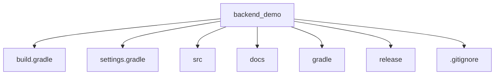

### 1.2 源码目录结构
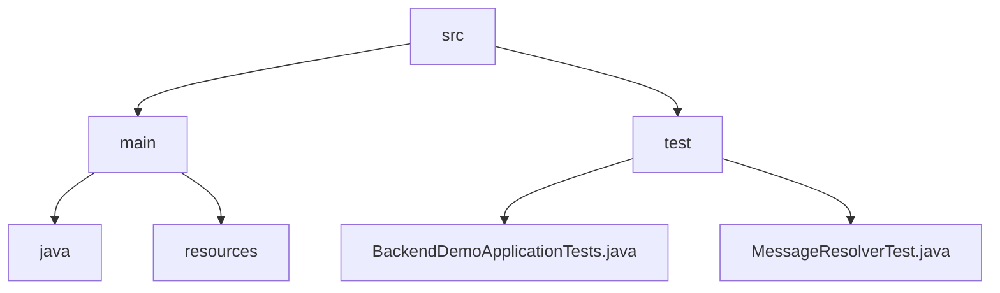

### 1.3 主包结构
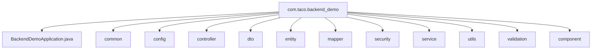

### 1.4 Common包结构
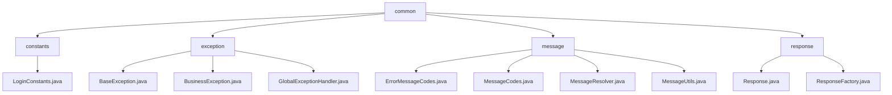

### 1.5 Controller包结构
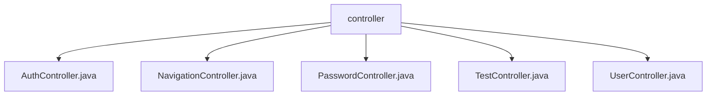

### 1.6 DTO包结构
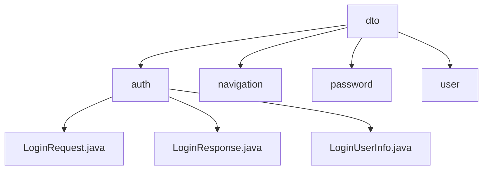

### 1.7 Entity包结构
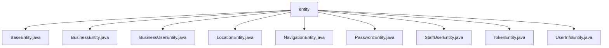

### 1.8 Mapper包结构
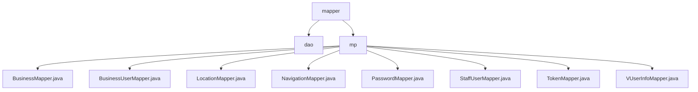

### 1.9 Security包结构
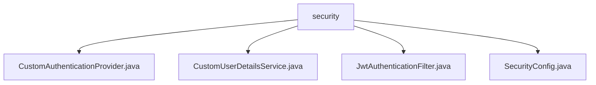

### 1.10 Resources目录结构
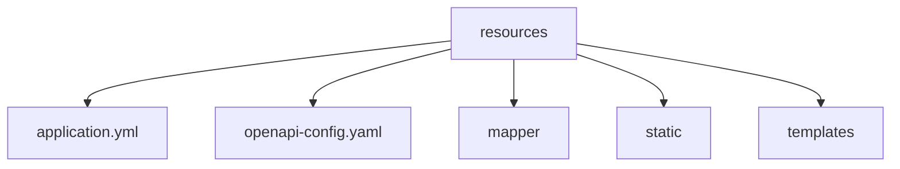

## 2. 项目使用的技术

### 2.1 核心技术栈

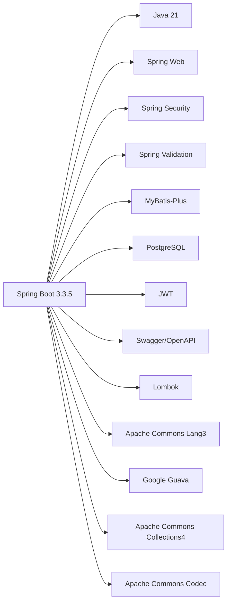

### 2.2 安全技术

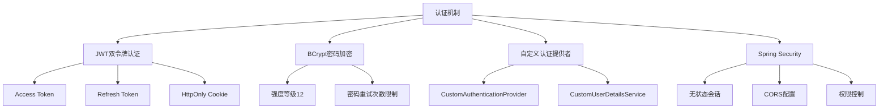

### 2.3 数据库技术

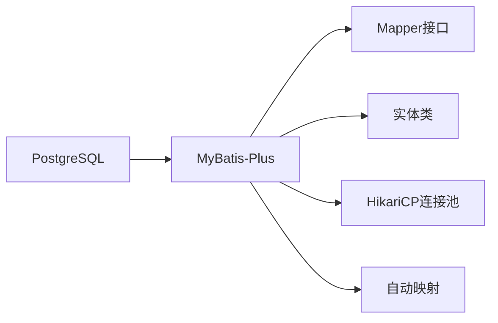

## 3. 项目代码结构

### 3.1 包结构设计

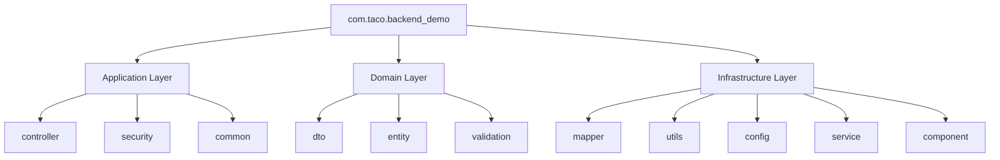

### 3.2 登录功能核心组件

#### 3.2.1 控制器层 (Controller)

```mermaid
graph TD
    A[AuthController] --> B[login()]
    A --> C[refreshToken()]
    A --> D[logout()]
    
    B --> E[验证用户凭据]
    B --> F[重置密码重试次数]
    B --> G[生成JWT令牌]
    B --> H[存储刷新令牌]
    B --> I[设置HttpOnly Cookie]
    
    C --> J[从Cookie获取刷新令牌]
    C --> K[验证刷新令牌]
    C --> L[生成新访问令牌]
    
    D --> M[清除刷新令牌Cookie]
    D --> N[删除数据库刷新令牌]
```

#### 3.2.2 安全配置层 (Security)

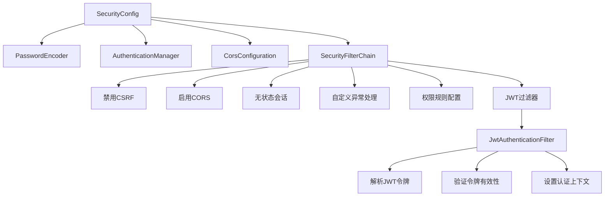

#### 3.2.3 认证服务层 (Authentication Service)

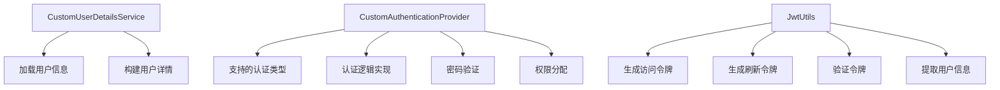

#### 3.2.4 数据传输对象 (DTO)

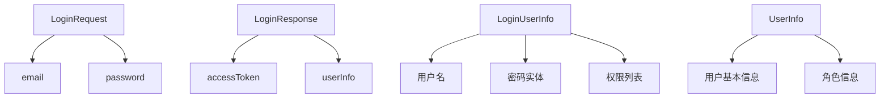

#### 3.2.5 实体层 (Entity)

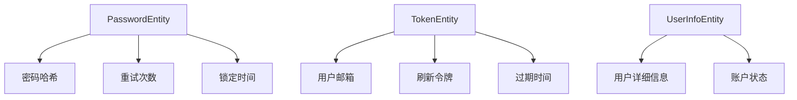

### 3.3 登录流程时序图

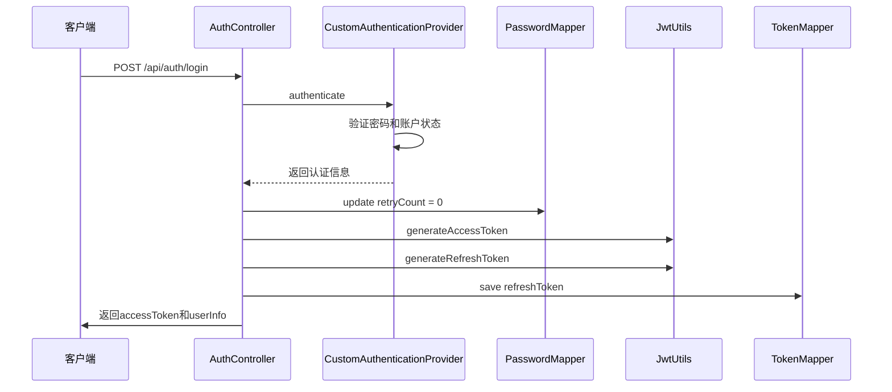

### 3.4 刷新令牌流程时序图

```mermaid
sequenceDiagram
    participant Client as 客户端
    participant AuthController as AuthController
    participant JwtUtils as JwtUtils
    
    Client->>AuthController: POST /api/auth/refresh
    AuthController->>AuthController: 从Cookie获取refreshToken
    AuthController->>JwtUtils: validateToken
    JwtUtils-->>AuthController: 验证结果
    AuthController->>JwtUtils: generateAccessToken
    AuthController->>Client: 返回新的accessToken
```

### 3.5 登出流程时序图

```mermaid
sequenceDiagram
    participant Client as 客户端
    participant AuthController as AuthController
    participant TokenMapper as TokenMapper
    
    Client->>AuthController: POST /api/auth/logout
    AuthController->>AuthController: 清除refreshToken Cookie
    AuthController->>TokenMapper: delete refreshToken
    AuthController->>Client: 返回登出成功
```

## 4. 关键配置说明

### 4.1 JWT配置
- **访问令牌有效期**: 2小时
- **刷新令牌有效期**: 7天
- **令牌存储**: 刷新令牌存储在数据库中，访问令牌仅在客户端内存中

### 4.2 安全配置
- **密码加密**: BCrypt算法，强度等级12
- **CORS配置**: 允许localhost:3000-3002的跨域请求
- **会话管理**: 无状态(STATELESS)
- **CSRF保护**: 已禁用(适用于JWT无状态认证)

### 4.3 数据库配置
- **数据库**: PostgreSQL
- **连接池**: HikariCP
- **最大连接数**: 10
- **最小空闲连接**: 2

## 5. API接口说明

### 5.1 登录接口
- **URL**: `POST /api/auth/login`
- **请求参数**: 
  - `email`: 用户邮箱
  - `password`: 用户密码
- **响应**: 
  - `accessToken`: JWT访问令牌
  - `userInfo`: 用户基本信息

### 5.2 刷新令牌接口
- **URL**: `POST /api/auth/refresh`
- **请求方式**: 从Cookie中读取refreshToken
- **响应**: 
  - `accessToken`: 新的JWT访问令牌
  - `userInfo`: 用户基本信息

### 5.3 登出接口
- **URL**: `POST /api/auth/logout`
- **功能**: 清除客户端Cookie和服务器端刷新令牌
- **响应**: 成功消息

## 6. 错误处理机制

### 6.1 认证相关错误码
- **E006**: 刷新令牌无效
- **E007**: 认证失败(未登录)
- **E008**: 授权失败(权限不足)
- **E014**: 字段不能为空
- **E015**: 邮箱格式不正确
- **E016**: 密码强度不足

### 6.2 异常处理
- **全局异常处理器**: `GlobalExceptionHandler`
- **统一响应格式**: `Response<T>`
- **错误消息国际化**: `MessageResolver`

## 7. 测试策略

### 7.1 单元测试
- **认证逻辑测试**: `CustomAuthenticationProvider`测试
- **消息解析测试**: `MessageResolverTest`
- **应用启动测试**: `BackendDemoApplicationTests`

### 7.2 集成测试
- **API端点测试**: 使用Spring Boot Test
- **安全配置测试**: Spring Security Test
- **数据库操作测试**: MyBatis-Plus Test

## 8. 部署说明

### 8.1 环境要求
- **JDK版本**: Java 21
- **数据库**: PostgreSQL 12+
- **构建工具**: Gradle 8+

### 8.2 配置文件
- **主配置**: `application.yml`
- **OpenAPI配置**: `openapi-config.yaml`
- **数据库脚本**: 位于`release/`目录

### 8.3 构建命令
```bash
# 清理并构建
./gradlew clean build

# 运行应用
./gradlew bootRun

# 清理端口
./gradlew cleanAll
```

## 9. 扩展性考虑

### 9.1 多因素认证
- 当前架构支持扩展MFA功能
- 可在`CustomAuthenticationProvider`中添加额外验证步骤

### 9.2 社交登录
- 可通过扩展`AuthController`和`CustomUserDetailsService`实现
- 支持OAuth2.0协议集成

### 9.3 权限系统
- 基于Spring Security的权限控制
- 支持方法级权限注解(`@PreAuthorize`)
- 角色定义在`LoginConstants.java`中

## 10. 性能优化

### 10.1 缓存策略
- 用户信息缓存可减少数据库查询
- 令牌黑名单缓存可提高登出效率

### 10.2 数据库优化
- 密码表和令牌表应有适当的索引
- 连接池配置已优化

### 10.3 安全优化
- 生产环境应启用HTTPS
- Cookie应设置`Secure=true`
- 密码重试次数限制防止暴力破解